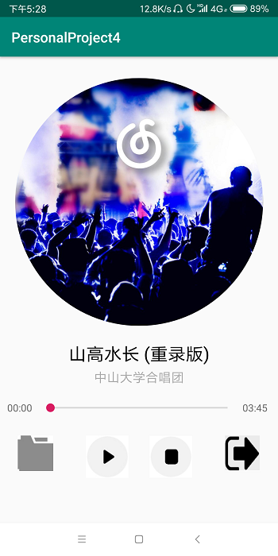
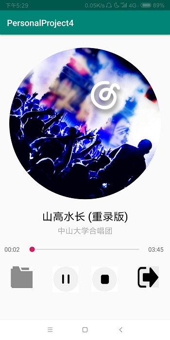
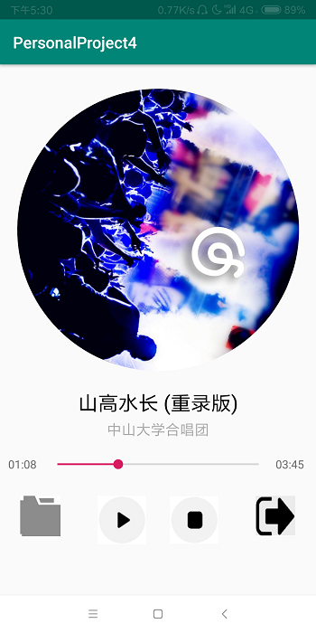
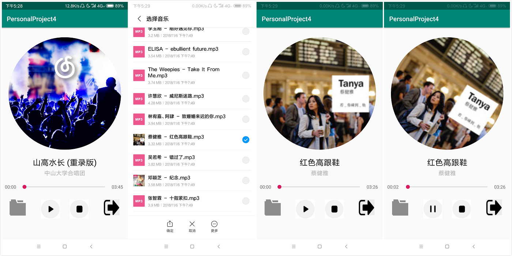

# 中山大学数据科学与计算机学院本科生实验报告

## （2018年秋季学期）

| 课程名称 | 手机平台应用开发 | 任课老师 | 郑贵锋 |
| :------------: | :-------------: | :------------: | :-------------: |
| 年级 | 2016级  | 专业（方向） |  计算机应用 |
| 学号 | 16340030 | 姓名 | 陈斯敏 |
| 电话 | 15917173057 | Email | 2540740154@qq.com |
| 开始日期 | 2018.11.24 | 完成日期 | 2018.11.26

---

## 一、实验题目

### **个人项目4**

### **简单音乐播放器**

#### 第十二周任务: **简单音乐播放器**

---

## 二、实验目的

### 1. 学会使用MediaPlayer
### 2. 学会简单的多线程编程，使用Handler更新UI
### 3. 学会使用Service进行后台工作
### 4. 学会使用Service与Activity进行通信。

---

## 三、实现内容

### 实验内容
#### 要求  
实现一个简单的播放器，要求功能有：  
<table>
    <tr>
        <td >打开程序主页面</td>
        <td >开始播放</td>
    </tr>
    <tr>
        <td >暂停</td>
        <td >停止</td>
    </tr>
</table>

1. 播放、暂停、停止、退出功能，按停止键会重置封面转角，进度条和播放按钮；按退出键将停止播放并退出程序
2. 后台播放功能，按手机的返回键和home键都不会停止播放，而是转入后台进行播放
3. 进度条显示播放进度、拖动进度条改变进度功能
4. 播放时图片旋转，显示当前播放时间功能，圆形图片的实现使用的是一个开源控件CircleImageView


**附加内容（加分项，加分项每项占10分）**

1.选歌

用户可以点击选歌按钮自己选择歌曲进行播放，要求换歌后不仅能正常实现上述的全部功能，还要求选歌成功后不自动播放，重置播放按钮，重置进度条，重置歌曲封面转动角度，最重要的一点：需要解析mp3文件，并更新封面图片。   

---

## 四、实验结果

### (1) 实验截图
* 打开程序主页面（初始化默认选择歌曲“山高水长”）：
  
  

* 开始播放（歌曲当前播放时间显示更新，进度条前进，封面旋转）：

  

* 点击暂停按钮暂停播放（封面停止旋转，进度条停止）：

  

* 点击停止按钮停止播放（封面恢复原位置，进度条回去起始点，歌曲当前播放时间显示更新）：

  

* 点击文件选择按钮选择本地音乐进行播放：

  


### (2) 实验步骤以及关键代码
* 实现主页面（登录界面）的页面布局文件 activity_main.xml，该页面并不复杂，主要是用了一个开源控件CircleImageView实现圆形封面图片，进度条使用的是seekbar，使用线性布局和layout_weight属性，使得进度条可以匹配屏幕大小适当伸缩：
    ```xml
    ...
    <de.hdodenhof.circleimageview.CircleImageView
        android:id="@+id/circle_image"
        android:layout_width="300dp"
        android:layout_height="300dp"
        android:src="@mipmap/img"
        app:layout_constraintTop_toTopOf="parent"
        app:layout_constraintStart_toStartOf="parent"
        app:layout_constraintEnd_toEndOf="parent"
        android:layout_marginTop="30dp"/>
    ...
    <SeekBar
        android:id="@+id/bar"
        android:layout_weight="1"
        android:layout_margin="5dp"
        android:layout_width="0dp"
        android:layout_height="wrap_content"
        android:layout_gravity="center_vertical"/>
    ...
    ```
* 创建后台服务类MusicService，同时在AndroidManifest.xml中注册该后台服务：
    ```xml
    <service android:name=".MusicService" android:exported="true"/>
    ```
* 在MusicService中实现类MyBinder，用以绑定后台服务与MainActivity：
  ```java
    public final IBinder binder = new MyBinder();
    public class MyBinder extends Binder {
        @Override
        protected boolean onTransact(int code, @NonNull Parcel data, @Nullable Parcel reply, int flags) throws RemoteException {
            switch (code) {
                //service solve
                case 0:  play(); break;
                case 1:  stop(); break;
                case 2: reply.writeInt(isPlaying()); break;
                case 3: reply.writeInt(getCurrenPostion()); break;
                case 4: reply.writeInt(getDuration()); break;
                case 5: seekTo(data.readInt()); break;
                case 6: reply.writeString(getPath()); break;
                case 7: setPath(data.readString()); break;
                default: break;
            }
            return super.onTransact(code, data, reply, flags);
        }
    }
  ```
* 初始化会获取“山高水长”的路径，保存在成员变量path中：
  ```java
    public MusicService() {
        try {
            initPath();
        } catch (IOException e) {
            e.printStackTrace();
        }
    }

    private void initPath() throws IOException {
        // 第一次运行应用程序时，加载数据库到data/data/当前包的名称/database/<db_name>
        File dir = new File("data/data/com.example.admin.personalproject4/data");

        if (!dir.exists() || !dir.isDirectory()) {
            dir.mkdir();
        }

        String filename = "山高水长.mp3";
        File file = new File(dir, filename);
        InputStream inputStream = null;
        OutputStream outputStream = null;

        //通过IO流的方式，将assets目录下的数据库文件，写入到SD卡中。
        if (!file.exists()) {
            try {
                file.createNewFile();
                inputStream = this.getClass().getClassLoader().getResourceAsStream("assets/" + filename);
                outputStream = new FileOutputStream(file);
                byte[] buffer = new byte[1024];
                int len ;
                while ((len = inputStream.read(buffer)) != -1) {
                    outputStream.write(buffer,0,len);
                }
            } catch (IOException e) {
                e.printStackTrace();
            }
            finally {
                if (outputStream != null) {
                    outputStream.flush();
                    outputStream.close();
                }
                if (inputStream != null) {
                    inputStream.close();
                }
            }
        }
        path = file.getPath();
        setPath(path);
    }
  ```
* 在该后台服务类中实现相关MediaPlayer的函数：
  ```java
    // 播放、暂停
    public void play() {
        if (mediaPlayer.isPlaying()) {
            mediaPlayer.pause();
        } else {
            mediaPlayer.start();
        }
    }

    // 是否播放中
    public boolean isPlaying() {
        return mediaPlayer.isPlaying();
    }

    // 停止播放
    public void stop() {
        if (mediaPlayer != null) {
            mediaPlayer.stop();
            try {
                mediaPlayer.prepare();
                mediaPlayer.seekTo(0);
            } catch (Exception e) {
                e.printStackTrace();
            }
        }
    }

    //返回歌曲的长度，单位为毫秒
    public int getDuration(){
        return mediaPlayer.getDuration();
    }

    //返回歌曲目前的进度，单位为毫秒
    public int getCurrenPostion(){
        return mediaPlayer.getCurrentPosition();
    }

    //设置歌曲播放的进度，单位为毫秒
    public void seekTo(int mesc){
        mediaPlayer.seekTo(mesc);
    }

    // 设置歌曲路径，同时reset播放器
    public void setPath(String path) {
        this.path = path;
        try {
            mediaPlayer.reset();
            mediaPlayer.setDataSource(path);
            mediaPlayer.prepare();
        }catch (Exception e) {
            e.printStackTrace();
        }
    }

    // 获取当前播放歌曲路径
    public String getPath() {
        return path;
    }
  ```
* 在MainActivity的onCreate函数设置seekbar的相关监听器函数：
  ```java
  seekBar.setOnSeekBarChangeListener(new SeekBar.OnSeekBarChangeListener() {
        @Override
        public void onProgressChanged(SeekBar seekBar, int progress, boolean fromUser) {
            // 进度条改变
            if (fromUser){
                seekTo(progress);
                int currenPostion = getCurrenPostion();
                int duration = getDuration();
                seekBar.setProgress(currenPostion);
                current.setText(formatTime(currenPostion));
                if (formatTime(currenPostion).equals(formatTime(duration))) {
                    mMusicAnimation.start();
                    mMusicAnimation.pause();
                    seekBar.setProgress(0);
                    current.setText(formatTime(0));
                    ImageView iv = findViewById(R.id.play);
                    iv.setImageResource(R.mipmap.play);
                    // 这里是使用Handler版本的实现， rxJava版本五以下部分
                    Message msg = handler.obtainMessage();
                    msg.arg1 = -1;
                    handler.sendMessage(msg);
                }
            }
        }

        @Override
        public void onStartTrackingTouch(SeekBar seekBar) {
            // 开始触摸进度条
        }

        @Override
        public void onStopTrackingTouch(SeekBar seekBar) {
            //停止触摸进度条
        }
    });
  ```
* 设置圆形封面图片的旋转动画，此处我采用ObjectAnimator来实现这个动画。
  ```java
    mMusicAnimation = ObjectAnimator.ofFloat(circleImageView, "rotation", 0f,360f);
    mMusicAnimation.setDuration(30000);
    mMusicAnimation.setInterpolator(new LinearInterpolator());//not stop 
    mMusicAnimation.setRepeatCount(-1);//set repeat time forever
  ```
* 同时在onCreate函数还需要绑定service，在onDestory函数进行解绑：
  ```java
    private ServiceConnection sc = new ServiceConnection() {
        @Override
        public void onServiceConnected(ComponentName name, IBinder service) {
            mBinder = service;
            try {
                // 获取初始音乐（山高水长）path并设置相关显示
                initByMusicPath(getMusicPath());
            } catch (Exception e) {
                e.printStackTrace();
            }
            // 启动rxJava观察者和被观察者
            startProgressListen();
        }

        @Override
        public void onServiceDisconnected(ComponentName name){

        }
    };

    @Override
    protected void onCreate(Bundle savedInstanceState) {
        super.onCreate(savedInstanceState);
        setContentView(R.layout.activity_main);

        Intent intent = new Intent(this, MusicService.class);
        bindService(intent, sc, BIND_AUTO_CREATE);
        ...
    }

    @Override
    protected void onDestroy() {
        super.onDestroy();
        //退出应用后与service解除绑定
        unbindService(sc);
    }
  ```
* 最开始使用的是：Handler配合Runnable设置定时更新进度条。（后边更新为使用rxJava， 以下是使用Handler的实现）
  ```java
      //使用handler定时更新进度条
    private Handler handler = new Handler() {
        @Override
        public void handleMessage(Message msg) {
            switch (msg.what) {
                case -1:
                    handler.removeCallbacks(mRunnable);
                    break;
                default:
                    // 每100ms更新一次
                    handler.postDelayed(mRunnable,100);
            }
        }
    };

    private Runnable mRunnable = new Runnable() {
        @Override
        public void run() {
            try {
                // 进度条更新，同时当前歌曲播放时间改变
                int currenPostion = getCurrenPostion();
                int duration = getDuration();
                seekBar.setProgress(currenPostion);
                current.setText(formatTime(currenPostion));
                Message msg = handler.obtainMessage();
                msg.arg1 = 1;
                // 歌曲播放到最后进行特殊处理
                if (formatTime(currenPostion).equals(formatTime(duration))) {
                    mMusicAnimation.start();
                    mMusicAnimation.pause();
                    seekBar.setProgress(0);
                    current.setText(formatTime(0));
                    ImageView iv = findViewById(R.id.play);
                    iv.setImageResource(R.mipmap.play);
                    msg.arg1 = -1;
                }
                handler.sendMessage(msg);
            } catch (Exception e) {
                e.printStackTrace();
            }
        }
    };
  ```
* 使用rxJava更新进度条的代码实现如下，这里被观察者每过500ms获取一次进度，然后通知观察者更新UI，封装成startProgressListen函数，在onServiceConnected函数中，也即绑定Activity和service时进行调用：
  ```java
      // 使用rxJava更新进度条
    private void startProgressListen() {
        final io.reactivex.Observable<Integer> observable = io.reactivex.Observable.create(new ObservableOnSubscribe<Integer>() {

            @Override
            public void subscribe(ObservableEmitter<Integer> e) throws Exception {
                while (true) {
                    try {
                        Thread.sleep(500); //每过500ms询问一下进度
                        e.onNext(getCurrenPostion());
                    } catch (InterruptedException exception) {
                        if (!e.isDisposed()) {
                            e.onError(exception);
                        }
                        break;
                    }
                }
                e.onComplete();
            }

        });
        DisposableObserver<Integer> disposableObserver = new DisposableObserver<Integer>() {

            @Override
            public void onNext(Integer value) {
                int currenPostion = value;
                int duration = getDuration();
                seekBar.setProgress(currenPostion);
                current.setText(formatTime(currenPostion));
                if (formatTime(currenPostion).equals(formatTime(duration))) {
                    mMusicAnimation.start();
                    mMusicAnimation.pause();
                    seekBar.setProgress(0);
                    current.setText(formatTime(0));
                    ImageView iv = findViewById(R.id.play);
                    iv.setImageResource(R.mipmap.play);
                }
            }

            @Override
            public void onError(Throwable e) {
                Log.d("BackgroundActivity", "onError=" + e);
            }

            @Override
            public void onComplete() {
                Log.d("BackgroundActivity", "onComplete");
            }
        };
        observable.subscribeOn(Schedulers.io()).observeOn(AndroidSchedulers.mainThread()).subscribe(disposableObserver);
        mCompositeDisposable.add(disposableObserver);
    }
  ```
* 为了歌曲时间的显示，我们需要给出一个“mm:ss”的时间转化函数（原来获取的是一个int）:
  ```java
    // 转化时间为“mm:ss”格式
    private String formatTime(int length){
        Date date = new Date(length);
        //时间格式化工具
        SimpleDateFormat sdf = new SimpleDateFormat("mm:ss");
        return sdf.format(date);
    }
  ```
* 根据音乐路径更新界面元素（选歌成功后不自动播放，重置播放按钮，重置进度条，重置歌曲封面转动角度，解析mp3文件，并更新封面图片）：
  ```java
    // 根据音乐的路径初始化界面和后台播放器（部分元素需要考虑特殊情况，如获取不到专辑图片等）。
    public void initByMusicPath(String path) {
        try {
            MediaPlayer mp = new MediaPlayer();
            mp.setDataSource(path);
            setMusicPath(path);
            // 设置进度条的最大值
            seekBar.setMax(getDuration());
            // 设置进度条的进度
            seekBar.setProgress(getCurrenPostion());
            // 设置最大时间
            end.setText(formatTime(getDuration()));
            // 设置音乐名称,歌手名称,专辑图片
            MediaMetadataRetriever mmr = new MediaMetadataRetriever();
            mmr.setDataSource(path);

            String song = mmr.extractMetadata(MediaMetadataRetriever.METADATA_KEY_TITLE);
            if (song == null||song.equals(""))
                song = "未知歌曲";
            ((TextView)findViewById(R.id.song)).setText(song);

            String singer = mmr.extractMetadata(MediaMetadataRetriever.METADATA_KEY_ARTIST);
            if (singer == null||singer.equals(""))
                singer = "未知歌曲";
            ((TextView)findViewById(R.id.singer)).setText(singer);

            try {
                byte[] picture = mmr.getEmbeddedPicture();
                Bitmap bitmap = BitmapFactory.decodeByteArray(picture, 0, picture.length);
                circleImageView.setImageBitmap(bitmap);
            } catch (NullPointerException e) {
                e.printStackTrace();
                circleImageView.setImageResource(R.mipmap.img);
            }
            mMusicAnimation.start();
            mMusicAnimation.pause();
        } catch (IOException e) {
            e.printStackTrace();
        }
        ImageView iv = findViewById(R.id.play);
        iv.setImageResource(R.mipmap.play);
    }
  ```
* 获取本地音乐的函数与之前项目获取图片的方法类似，需要在AndroidManifest.xml中给定权限：
  ```xml
    <uses-permission-sdk-23 android:name="android.permission.READ_EXTERNAL_STORAGE"/>
    <uses-permission android:name="android.permission.READ_EXTERNAL_STORAGE" />
  ```
* 选取文件之后，回调函数会调用前面的initByMisicPath函数，根据path调整界面元素，同时生成一个新的MediaPlayer，替换后台服务中的MediaPlayer,:
  ```java
    @Override
    protected void onActivityResult(int requestCode, int resultCode, Intent data) {
        if (resultCode == Activity.RESULT_OK) {
            Uri uri = data.getData();
            String path = getPath(this, uri);
            initByMisicPath(path);
        }
    }
  ```
* 接下来是界面几个按钮函数的实现，除了调用后台服务函数进行调整播放器，还需要考虑封面图片动画和进度条更新等因素,图片动画有start\pause\resume等函数，分别作用是令动画开始播放、暂停播放、继续播放。返回按钮函数需要解除与后台服务的绑定，并停止handler的刷新，然后finish页面：
  ```java
    // 暂停、播放按钮点击函数
    public void playButtonOnclick(View view) {
        ImageView iv = findViewById(R.id.play);
        PlayAndPause();
        if (isPlaying()) {
            iv.setImageResource(R.mipmap.pause);
            if (!mMusicAnimation.isStarted()) {
                mMusicAnimation.start();
            } else {
                mMusicAnimation.resume();
            }
        } else {
            iv.setImageResource(R.mipmap.play);
            mMusicAnimation.pause();
        }
    }

    // 停止播放按钮点击函数
    public void stopButtonOnclick(View view) {
        try {
            stop();
            ImageView iv = findViewById(R.id.play);
            iv.setImageResource(R.mipmap.play);
            mMusicAnimation.end();
        } catch (Exception e) {
            e.printStackTrace();
        }
    }

    // 选择文件按钮函数
    public void fileButtonOnclick(View view) {
        Intent intent = new Intent(Intent.ACTION_GET_CONTENT);
        intent.setType("audio/*"); //选择音频
        intent.addCategory(Intent.CATEGORY_OPENABLE);
        startActivityForResult(intent, 1);
    }

    // 返回按钮函数
    public void backButtonOnclick(View view) {
        unbindService(sc);
        try {
            MainActivity.this.finish();
            System.exit(0);
        } catch (Exception e) {
            e.printStackTrace();
        }
    }
  ```
* 使用binder与service通信，使用的是 transact 和 onTransact，利用Parcel通信，每次都需要捕获异常，写在逻辑代码中较为冗余，这里将各个方法封装成函数以供调用：
  ```java
    public void PlayAndPause() {
        try {
            Parcel data = Parcel.obtain(), reply = Parcel.obtain();
            mBinder.transact(0, data, reply, 0);
        } catch (Exception e) {
            e.printStackTrace();
        }
    }

    public void stop() {
        try {
            Parcel data = Parcel.obtain(), reply = Parcel.obtain();
            mBinder.transact(1, data, reply, 0);
        } catch (Exception e) {
            e.printStackTrace();
        }
    }

    public boolean isPlaying() {
        try {
            Parcel data = Parcel.obtain(), reply = Parcel.obtain();
            mBinder.transact(2, data, reply, 0);
            if (reply.readInt() == 1)
                return true;
            else
                return false;
        } catch (Exception e) {
            e.printStackTrace();
            return false;
        }
    }

    public int getCurrenPostion() {
        try {
            Parcel data = Parcel.obtain(), reply = Parcel.obtain();
            mBinder.transact(3, data, reply, 0);
            return reply.readInt();
        } catch (Exception e) {
            e.printStackTrace();
            return 0;
        }
    }

    public int getDuration() {
        try {
            Parcel data = Parcel.obtain(), reply = Parcel.obtain();
            mBinder.transact(4, data, reply, 0);
            return reply.readInt();
        } catch (Exception e) {
            e.printStackTrace();
            return 0;
        }
    }

    public void seekTo(int mesc) {
        try {
            Parcel data = Parcel.obtain(), reply = Parcel.obtain();
            data.writeInt(mesc);
            mBinder.transact(5, data, reply, 0);
        } catch (Exception e) {
            e.printStackTrace();
        }
    }

    public String getMusicPath() {
        try {
            Parcel data = Parcel.obtain(), reply = Parcel.obtain();
            mBinder.transact(6, data, reply, 0);
            return reply.readString();
        }catch (Exception e) {
            e.printStackTrace();
            return null;
        }
    }

    public void setMusicPath(String path) {
        try {
            Parcel data = Parcel.obtain(), reply = Parcel.obtain();
            data.writeString(path);
            mBinder.transact(7, data, reply, 0);
        }catch (Exception e) {
            e.printStackTrace();
        }
    }
  ```


### (3) 实验遇到的困难以及解决思路
#### 问题一：如何实现seekbar能够自动随屏幕大小伸缩。
解决：此处我还是利用线性布局的layout_weight属性，使用一个线性布局将seekbar和两个显示时间的TextView包起来，然后设置线性布局的width为match_parent，设置seekbar的layout_weight为1，便可以实现seekbar自动随屏幕大小延伸。
#### 问题二：选择音乐文件后，将路径传给后台服务类，后台服务根据该路径获取音乐时总是报错无法获得。
解决：mediaplayer重新设置音乐路径时忘记reset了，导致其直接异常，而自己错认为是权限的问题，所以先reset，再重新setDataSource(filepath)
####问题三：按手机返回之后，MainActivity会被销毁，点击程序进入页面会重新create，导致封面图片动画，歌曲名称等界面因素被重新覆盖调整（虽然后台音乐播放没有被销毁），如何保证这些因素不会被重置。
解决：只要MainActivity没有被销毁，那么重新打开时就不会调用onCreate函数，就不会重新调整界面元素，所以我设置点击手机返回按钮不会马上销毁Activity，而是将该Activity转到后台任务中，需要重写函数onKeyDown，如下：
  ```java
  @Override
  public boolean onKeyDown(int keyCode, KeyEvent event) {
      if(keyCode == KeyEvent.KEYCODE_BACK){
          moveTaskToBack(true);
          return true;
      }
      return super.onKeyDown(keyCode, event);
  }
  ```
这样便实现点击手机返回按钮退出，返回时页面因素不会重新加载覆盖。

---

## 五、实验思考及感想

这周的任务不算特别难，看着tutorial和课程的ppt，查查相应的博客，还是可以很快写完该次作业的，但是其实此次作业涵盖的知识点还是很丰富且有意思的，多线程编程是很多编程语言的重点和难点，虽然这次涉及的不算特别深（也许只是冰山一角），但接下来应该会继续深入学习并加深使用吧。通过此次作业，我有以下收获：
1. 学会使用MediaPlayer，实现一个音乐播放器，虽然比较简单，但还是相对有成就感的。
2. 学会简单的多线程编程，最开始使用Handler异步更新UI（进度条更新），而后一周又采用rxJava进行异步更新进度条。
3. 学会使用Service进行后台工作（实现播放器后台播放，退出可以继续播放）。
4. 复习界面设计布局，同时学习一些新的组件（seekbar）的监听器的实现。

---
